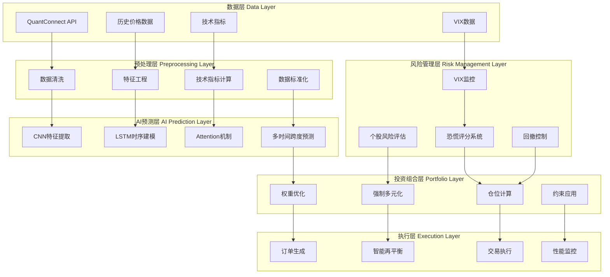
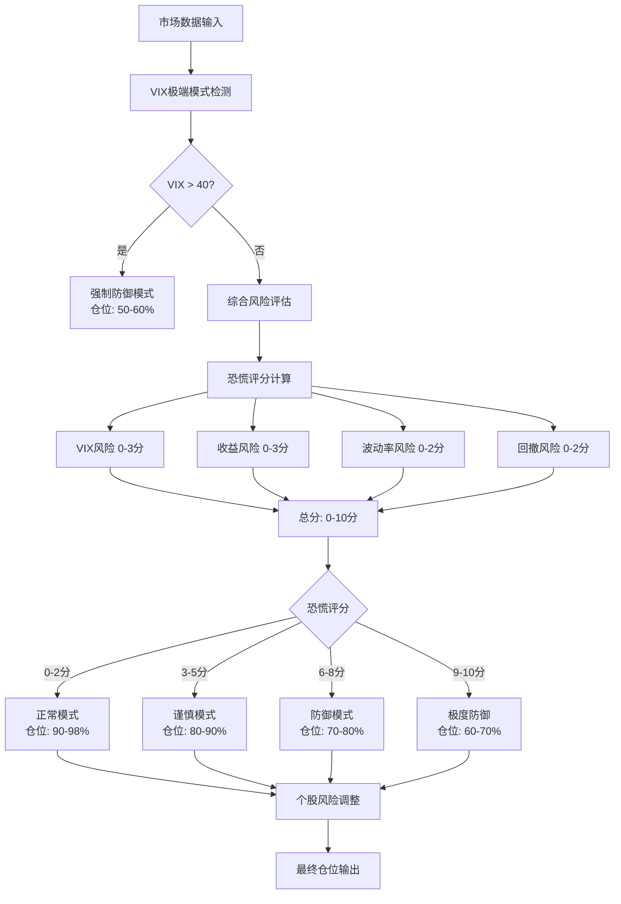
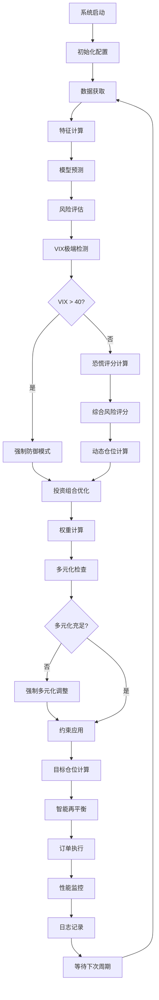
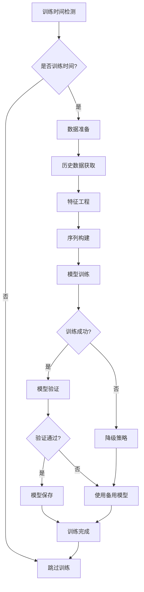

# Multi Equity CNN-LSTM-Attention 量化交易系统

## 📊 项目概述

基于深度学习的多股票量化交易系统，采用CNN-LSTM-Attention神经网络架构进行价格预测，集成先进的风险管理、投资组合优化和强制多元化机制。系统通过分层风险控制和智能仓位管理，实现了从传统保守策略（15-30%仓位）到积极策略（70-95%仓位）的重大突破。

### 🎯 核心特性

- **🧠 深度学习预测**：CNN-LSTM-Attention多层神经网络架构
- **⚖️ 智能仓位管理**：分层风险控制，恐慌评分系统，动态仓位调整
- **🛡️ VIX风险管理**：基于VIX的动态防御与快速恢复机制
- **📈 投资组合优化**：多策略组合（均值方差、风险平价、最大分散化）
- **🔄 训练时间分离**：交易与训练时间完全分离，提升执行效率
- **🎯 强制多元化**：多维度风险分散，避免过度集中
- **📊 实时监控**：系统状态、风险指标、性能分析全方位监控

## 🏗️ 系统架构

### 整体架构图



### 核心模块详解

#### 1. 数据处理模块 (`data_processing.py`)

**功能**：多源数据获取、清洗和特征工程

```python
class DataProcessor:
    # 核心方法
    - get_historical_data()     # 获取历史价格数据
    - calculate_features()      # 计算技术指标特征
    - prepare_sequences()       # 准备LSTM输入序列
    - normalize_data()          # 数据标准化处理
```

**技术指标体系**：
- **趋势指标**：SMA, EMA, MACD, ADX
- **动量指标**：RSI, CCI, Williams %R
- **波动率指标**：Bollinger Bands, ATR
- **成交量指标**：OBV, Volume SMA
- **市场情绪**：VIX相关指标

#### 2. 模型训练模块 (`model_training.py`, `training_manager.py`)

**CNN-LSTM-Attention架构**：

```
输入层 (特征维度: 15)
    ↓
CNN层 (卷积特征提取)
├── Conv1D(64, kernel_size=3)
├── Conv1D(32, kernel_size=3)
└── MaxPooling1D(2)
    ↓
LSTM层 (时序建模)
├── LSTM(50, return_sequences=True)
└── LSTM(25)
    ↓
Attention层 (注意力机制)
├── Dense(50, activation='tanh')
├── Dense(1, activation='softmax')
└── 加权求和
    ↓
输出层
├── Dense(25, activation='relu')
├── Dropout(0.3)
└── Dense(1, activation='linear')
```

**训练策略**：
- **时间分离**：非交易时间进行模型训练
- **增量更新**：基于新数据持续优化
- **多重备用**：训练失败时的降级策略

#### 3. 预测引擎 (`prediction.py`)

**多时间跨度预测框架**：

```python
# 预测时间跨度
PREDICTION_HORIZONS = {
    'short': 1,      # 1天短期预测
    'medium': 5,     # 5天中期预测  
    'long': 10       # 10天长期预测
}

# 预测流程
def generate_predictions():
    1. 数据预处理
    2. 模型推理
    3. 不确定性量化
    4. 置信度评估
    5. 信号生成
```

#### 4. 风险管理模块 (`risk_management.py`)

**分层风险控制架构**：



**恐慌评分系统**：

| 风险因子 | 权重 | 评分标准 |
|---------|------|---------|
| VIX风险 | 30% | VIX < 20 (0分) → VIX > 35 (3分) |
| 收益风险 | 30% | 收益 > 0% (0分) → 收益 < -4% (3分) |
| 波动率风险 | 25% | 波动率 < 20% (0分) → 波动率 > 40% (2分) |
| 回撤风险 | 15% | 回撤 < 2% (0分) → 回撤 > 5% (2分) |

#### 5. 投资组合优化模块 (`portfolio_optimization.py`)

**多策略权重优化**：

```python
# 优化策略组合
OPTIMIZATION_STRATEGIES = {
    'mean_variance': 0.4,        # 均值方差优化 40%
    'risk_parity': 0.3,          # 风险平价策略 30%
    'max_diversification': 0.3   # 最大分散化策略 30%
}

# 约束条件
CONSTRAINTS = {
    'min_weight': 0.05,          # 最小权重 5%
    'max_weight': 0.20,          # 最大权重 20%
    'max_sector_weight': 0.40,   # 最大行业权重 40%
    'min_stocks': 4,             # 最少股票数量
    'max_concentration': 0.80    # 最大集中度
}
```

#### 6. 强制多元化模块 (`diversification_enforcer.py`)

**多元化指标体系**：

```python
# 多元化评估指标
def calculate_diversification_metrics():
    return {
        'n_stocks': len(weights > min_weight),           # 有效股票数量
        'max_weight': max(weights),                      # 最大权重
        'concentration_ratio': sum(top_3_weights),       # 前3大集中度
        'herfindahl_index': sum(weights**2),            # 赫芬达尔指数
        'effective_stocks': 1 / herfindahl_index,       # 有效股票数
        'gini_coefficient': calculate_gini(weights)      # 基尼系数
    }

# 多元化不足判断
def is_under_diversified():
    return (
        n_stocks < 4 or                    # 少于4只股票
        max_weight > 0.5 or                # 单股超过50%
        concentration_ratio > 0.8 or       # 前3大超过80%
        effective_stocks < 3               # 有效股票少于3只
    )
```

## 🔄 系统流程

### 主要交易流程图



### 训练流程图



## ⚙️ 配置参数详解

### 1. 基础配置 (`config.py`)

```python
# === 股票池配置 ===
SYMBOLS = [
    # 大盘ETF
    "SPY",           # SPDR S&P 500 ETF
    
    # 科技股
    "AAPL",          # 苹果
    "MSFT",          # 微软  
    "GOOG",          # 谷歌
    "META",          # Meta
    "NVDA",          # 英伟达
    "AVGO",          # 博通
    "INTC",          # 英特尔
    
    # 其他行业
    "AMZN",          # 亚马逊
    "LLY",           # 礼来制药
    "TSLA",          # 特斯拉
    "NFLX",          # 奈飞
    
    # 黄金和杠杆ETF
    "GLD",           # 黄金ETF
    "TQQQ",          # 3倍做多纳斯达克
    "SQQQ"           # 3倍做空纳斯达克
]

# === 基础参数 ===
INITIAL_CASH = 100000        # 初始资金
LOOKBACK_DAYS = 252          # 历史数据回看天数
REBALANCE_FREQUENCY = 1      # 再平衡频率(天)
```

### 2. 风险管理配置

```python
# === VIX风险管理 ===
VIX_CONFIG = {
    'extreme_level': 40,              # VIX极端水平
    'high_level': 30,                 # VIX高风险水平
    'normal_level': 20,               # VIX正常水平
    'rapid_rise_threshold': 0.30,     # 快速上升阈值30%
    'recovery_threshold': 0.20        # 恢复阈值20%
}

# === 仓位管理 ===
POSITION_CONFIG = {
    'base_equity_ratio': 0.95,        # 基础股票仓位95%
    'min_equity_ratio': 0.60,         # 最低股票仓位60%
    'extreme_defense_ratio': 0.50,    # 极端防御仓位50%
    'cash_buffer': 0.05               # 现金缓冲5%
}

# === 风险阈值 ===
RISK_THRESHOLDS = {
    'negative_return_threshold': -0.04,    # 负收益阈值-4%
    'volatility_threshold': 0.40,          # 波动率阈值40%
    'drawdown_threshold': 0.05,            # 回撤阈值5%
    'correlation_threshold': 0.80          # 相关性阈值80%
}
```

### 3. 模型配置

```python
# === CNN-LSTM-Attention配置 ===
MODEL_CONFIG = {
    'sequence_length': 60,            # LSTM序列长度
    'feature_dim': 15,                # 特征维度
    'cnn_filters': [64, 32],          # CNN卷积核数量
    'lstm_units': [50, 25],           # LSTM单元数量
    'dropout_rate': 0.3,              # Dropout比例
    'learning_rate': 0.001,           # 学习率
    'batch_size': 32,                 # 批次大小
    'epochs': 50                      # 训练轮数
}

# === 预测配置 ===
PREDICTION_CONFIG = {
    'horizons': {
        'short': 1,                   # 短期预测1天
        'medium': 5,                  # 中期预测5天
        'long': 10                    # 长期预测10天
    },
    'confidence_threshold': 0.6,      # 置信度阈值
    'uncertainty_threshold': 0.3      # 不确定性阈值
}
```

### 4. 投资组合优化配置

```python
# === 优化策略权重 ===
OPTIMIZATION_WEIGHTS = {
    'mean_variance': 0.4,             # 均值方差优化40%
    'risk_parity': 0.3,               # 风险平价30%
    'max_diversification': 0.3        # 最大分散化30%
}

# === 约束条件 ===
PORTFOLIO_CONSTRAINTS = {
    'min_weight': 0.05,               # 最小权重5%
    'max_weight': 0.20,               # 最大权重20%
    'max_sector_weight': 0.40,        # 最大行业权重40%
    'turnover_limit': 0.30,           # 换手率限制30%
    'transaction_cost': 0.001         # 交易成本0.1%
}
```

### 5. 强制多元化配置

```python
# === 多元化约束 ===
DIVERSIFICATION_CONFIG = {
    'min_stocks': 4,                  # 最少股票数量
    'max_concentration': 0.80,        # 最大集中度80%
    'max_single_weight': 0.50,        # 单股最大权重50%
    'target_effective_stocks': 6,     # 目标有效股票数
    'gini_threshold': 0.60           # 基尼系数阈值
}

# === 强制调整策略 ===
ENFORCEMENT_STRATEGIES = {
    'expand_universe': True,          # 扩展股票池
    'redistribute_weights': True,     # 重新分配权重
    'equal_weight_fallback': True     # 等权重备用策略
}
```

### 6. 系统监控配置

```python
# === 日志配置 ===
LOGGING_CONFIG = {
    'log_level': 'DEBUG',             # 日志级别
    'enable_position_logging': True,  # 启用仓位日志
    'enable_risk_logging': True,      # 启用风险日志
    'enable_performance_logging': True, # 启用性能日志
    'log_delay_minutes': 5            # 日志延迟分钟数
}

# === 性能监控 ===
PERFORMANCE_CONFIG = {
    'benchmark': 'SPY',               # 基准指数
    'risk_free_rate': 0.02,           # 无风险利率2%
    'rolling_window': 252,            # 滚动窗口252天
    'update_frequency': 'daily'       # 更新频率
}
```

## 📊 关键指标监控

### 1. 仓位监控指标

| 指标 | 描述 | 正常范围 | 警告阈值 |
|------|------|----------|----------|
| 股票仓位比例 | 总股票投资占比 | 70%-98% | <60% 或 >98% |
| 现金比例 | 现金及等价物占比 | 2%-30% | <2% 或 >40% |
| 恐慌评分 | 综合风险评分 | 0-5分 | >6分 |
| VIX风险状态 | VIX相关风险等级 | 正常/谨慎 | 极端防御 |

### 2. 多元化监控指标

| 指标 | 描述 | 目标值 | 警告阈值 |
|------|------|--------|----------|
| 有效股票数 | 实际分散的股票数量 | ≥6只 | <4只 |
| 最大单股权重 | 单只股票最大占比 | ≤20% | >30% |
| 前三大集中度 | 前3大持仓总占比 | ≤60% | >80% |
| 赫芬达尔指数 | 权重分散程度 | ≤0.25 | >0.35 |

### 3. 风险监控指标

| 指标 | 描述 | 正常范围 | 警告阈值 |
|------|------|----------|----------|
| 日收益率 | 当日投资组合收益 | -2% ~ +3% | <-4% 或 >5% |
| 滚动波动率 | 20日滚动波动率 | 10%-30% | >40% |
| 最大回撤 | 从峰值的最大跌幅 | <5% | >8% |
| VIX水平 | 恐慌指数当前值 | 15-25 | >35 |

## 🚀 部署和使用

### 1. 环境要求

```bash
# Python环境
Python 3.8+
TensorFlow 2.8+
NumPy 1.21+
Pandas 1.3+
SciPy 1.7+

# QuantConnect环境
QuantConnect Cloud/Local
.NET Framework支持

# 硬件要求
RAM: 8GB+ (推荐16GB)
GPU: 可选但推荐
存储: 10GB+
```

### 2. 安装步骤

```bash
# 1. 克隆代码库
git clone <repository_url>
cd Multi-Equity-CNN-LSTM-Attention

# 2. 安装依赖
pip install -r requirements.txt

# 3. 配置参数
cp config.py.example config.py
# 编辑config.py中的参数

# 4. 初始化系统
python main.py --init

# 5. 启动算法
python main.py --run
```

### 3. 配置检查清单

- [ ] 股票池配置 (`SYMBOLS`)
- [ ] 初始资金设置 (`INITIAL_CASH`)
- [ ] VIX风险阈值 (`VIX_CONFIG`)
- [ ] 仓位管理参数 (`POSITION_CONFIG`)
- [ ] 模型训练配置 (`MODEL_CONFIG`)
- [ ] 日志设置 (`LOGGING_CONFIG`)
- [ ] QuantConnect API密钥配置

### 4. 监控和维护

```python
# 日常监控命令
python system_monitor.py --status      # 系统状态检查
python system_monitor.py --performance # 性能分析
python system_monitor.py --risk        # 风险监控
python system_monitor.py --logs        # 日志分析

# 定期维护
python main.py --retrain              # 重新训练模型
python main.py --validate             # 验证系统配置
python main.py --backup               # 备份系统状态
```

## 📈 性能优化建议

### 1. 仓位优化

- **正常市场**：保持90-98%仓位，充分捕获上涨收益
- **波动市场**：动态调整至80-90%，平衡收益与风险
- **熊市环境**：降至60-70%，重点保护资本
- **极端情况**：强制降至50%，等待市场恢复

### 2. 风险控制

- **分层防御**：避免单一风险因子过度影响
- **动态调整**：基于市场状态实时调整策略
- **快速响应**：VIX快速变化时及时调整仓位
- **恢复机制**：市场好转时迅速提升仓位

### 3. 模型优化

- **增量训练**：基于新数据持续优化模型
- **集成学习**：多模型组合提升预测精度
- **特征工程**：持续优化技术指标和特征
- **超参数调优**：定期优化模型参数

## 📚 技术文档索引

### 核心技术文档
- [强制多元化设置指南](DIVERSIFICATION_ENFORCEMENT_GUIDE.md)
- [仓位控制修复总结](POSITION_CONTROL_FIX_SUMMARY.md)
- [VIX风险管理增强](VIX_RISK_MANAGEMENT_ENHANCEMENT.md)
- [训练时间分离指南](TRAINING_SEPARATION_GUIDE.md)

### 修复和优化文档
- [数组比较错误修复](ARRAY_COMPARISON_FIX.md)
- [仓位管理优化报告](POSITION_MANAGEMENT_OPTIMIZATION.md)
- [VIX恢复机制实施](VIX_RECOVERY_MECHANISM_IMPLEMENTATION.md)
- [训练改进综合报告](TRAINING_IMPROVEMENTS_COMPREHENSIVE.md)

### 配置和使用指南
- [风险控制开关指南](RISK_CONTROL_SWITCHES_GUIDE.md)
- [日志延迟配置指南](LOG_DELAY_CONFIG_GUIDE.md)
- [无交易问题修复](NO_TRADES_ISSUE_FIX.md)

## 🔄 版本历史

### v3.0 (2024-12) - 当前版本
- **重大更新**：完整系统架构重构
- 强制多元化系统实施
- 数组比较错误修复
- 详细架构文档和流程图
- 参数配置体系完善

### v2.0 (2024-12)
- **突破性更新**：仓位管理架构重构
- 分层风险控制系统
- 恐慌评分机制
- 仓位从15-30%提升到70-95%

### v1.5 (2024-11)
- VIX风险管理增强
- 训练时间分离优化
- 增量更新机制改进

### v1.0 (2024-10)
- 基础CNN-LSTM-Attention架构
- 多策略投资组合优化
- 基础风险管理框架

## 🤝 贡献指南

### 代码贡献
1. Fork项目仓库
2. 创建功能分支
3. 提交代码更改
4. 创建Pull Request
5. 代码审查和合并

### 文档贡献
- 改进现有文档
- 添加使用示例
- 翻译多语言版本
- 修复文档错误

### 问题反馈
- 提交Bug报告
- 功能请求
- 性能优化建议
- 使用问题咨询

## 📄 许可证

本项目采用MIT许可证，详见[LICENSE](LICENSE)文件。

## 📞 联系方式

- **项目维护者**：[维护者姓名]
- **邮箱**：[邮箱地址]
- **GitHub**：[GitHub链接]
- **文档网站**：[文档链接]

---

**注意**：本系统仅供学习和研究使用，投资有风险，请谨慎使用于实际交易。 